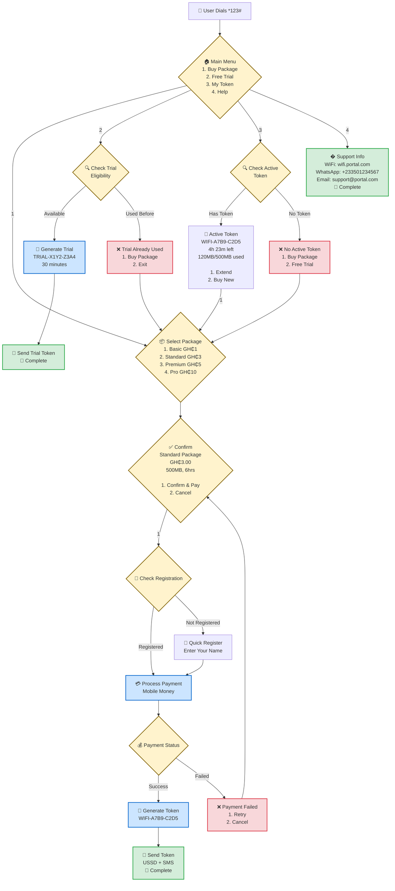

# USSD WiFi Portal - Complete Step-by-Step Flow

## Every Single USSD Screen & User Interaction



## Simplified User Paths

### � **Path 1: Buy Package (New User)**
```
*123# → Main Menu → Buy Package → Select Standard → Confirm 
→ Register Name → Pay → Token Generated → SMS Sent ✅
```

### 🛒 **Path 2: Buy Package (Returning User)**
```
*123# → Main Menu → Buy Package → Select Premium → Confirm 
→ Pay → Token Generated → SMS Sent ✅
```

### 🎁 **Path 3: Get Free Trial**
```
*123# → Main Menu → Free Trial → Check Eligibility 
→ Generate Trial → SMS Sent ✅
```

### 📱 **Path 4: Check My Token**
```
*123# → Main Menu → My Token → Show Active Token 
→ 4h 23m left, 120MB used ✅
```

### 🆘 **Path 5: Get Help**
```
*123# → Main Menu → Help → Contact Information ✅
```

## Sample USSD Screens

### 🏠 **Main Menu**
```
🌐 WiFi Portal
1. Buy Internet Package
2. Get Free Trial (30min)
3. My Active Token
4. Help & Support
```

### 📦 **Package Selection**
```
Select Package:
1. Basic - GH₵1
   100MB • 1 hour
2. Standard - GH₵3 ⭐
   500MB • 6 hours  
3. Premium - GH₵5
   1GB • 12 hours
4. Pro - GH₵10
   3GB • 24 hours
```

### ✅ **Confirmation**
```
Standard Package
Price: GH₵3.00
Data: 500MB
Valid: 6 hours

1. Confirm & Pay
2. Cancel
```

### 🎉 **Success**
```
Payment Successful!

Token: WIFI-A7B9-C2D5
Valid: 6 hours
Expires: Oct 17, 8:00PM

SMS sent with login details.
```

### 🎁 **Trial Success**
```
Free Trial Active!

Token: TRIAL-X1Y2-Z3A4
Valid: 30 minutes
Expires: Oct 17, 3:00PM

Connect at wifi.portal.com
```

